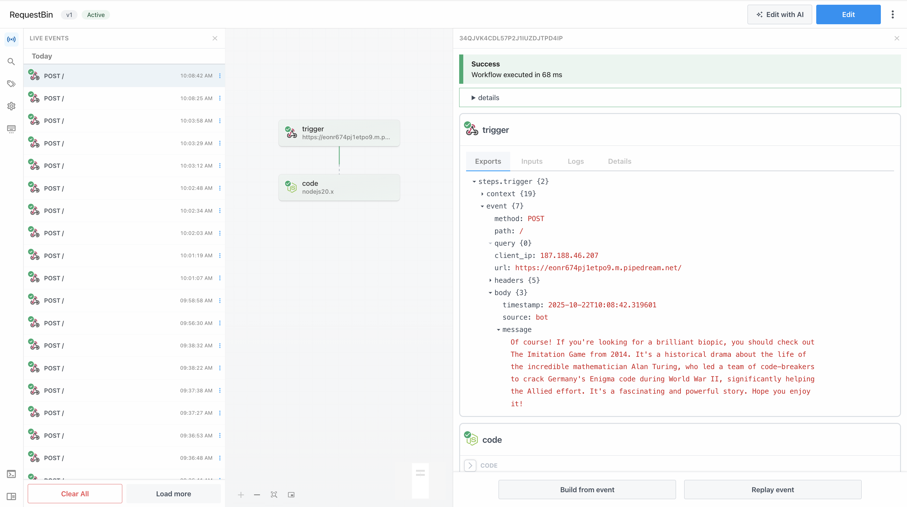

# CineBot 🎥

**CineBot** es una aplicación móvil desarrollada con Flutter que permite a los usuarios conversar con un chatbot inteligente para recibir sugerencias personalizadas de películas y crear una lista de películas por ver.

---

## Características principales

- Chat interactivo con **Gemini AI** con recepción de imágenes.  
- **Sugerencias de películas** según tus preferencias.  
- **Lista de películas pendientes** por ver.  
- **Pantalla de detalles** con información de reparto, género, duración y más.  
- **Animación de escritura** del bot.  
- Integración con **APIs externas** para obtener datos de películas.  
- Manejo de **tokens y variables de entorno** con `dotenv`.  
- **Internacionalización (i18n)** en inglés y español.  
- **Historial de conversación** guardado localmente y en **Pipedream RequestBin**.  
- **Manejo de errores** en las respuestas del chat.
---

## APIs utilizadas

### 1. **Gemini AI API (Google Generative AI)**
- Procesa las preguntas del usuario y genera respuestas naturales al sugerir películas.  
- 🔗 [https://ai.google.dev](https://ai.google.dev)

### 2. **TMDB API (The Movie Database)**
- Proporciona información de películas: título, sinopsis, pósters, reparto, calificación, etc.  
- 🔗 [https://developer.themoviedb.org/docs/getting-started](https://developer.themoviedb.org/docs/getting-started)

### 3. Pipedream RequestBin
- Almacena las conversaciones entre el bot y el usuario.  
- 🔗 [https://pipedream.com/requestbin](https://pipedream.com/requestbin/)

---
## Demo


Chat:


Watchlist:


Movie details:


Error handling:


Pipedream RequestBin:


--- 


## Instrucciones para correr la app

### 1. Clonar el repos🔗itorio
```bash
git clone https://github.com/aydin-due/cine_bot.git
cd cine_bot
```

### 2. Instalar dependencias
```bash
flutter pub get
```

### 3. Configurar variables de entorno
Crea un archivo .env en la raíz del proyecto con tus claves:
```bash
GEMINI_API_KEY=tu_clave_de_gemini
TMDB_API_KEY=tu_clave_de_tmdb
```

### 4. Ejecutar la aplicación
```bash
flutter run
```

---

## Enlaces de descarga
- 🔗 [APK (Android)](https://github.com/aydin-due/cine_bot/releases/download/v1.0.0/cine_bot-v1.0.0.apk)